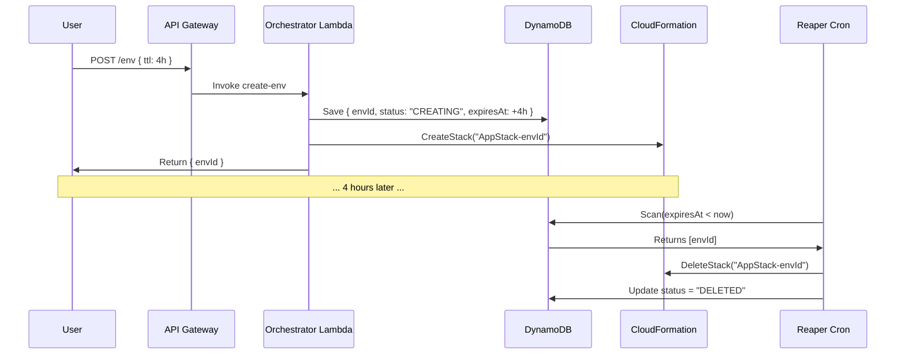

# Ephemeral Environment Manager

A Node.js backend service that helps engineering teams manage costs and testing velocity by spinning up temporary, isolated application environments and ensuring they are destroyed when no longer needed.

## The Concept

In modern platform engineering, developers often need an isolated environment to test a feature branch (e.g., `feature/login-refactor`). Spinning up a full copy of the stack is great for isolation but terrible for costs if those environments are forgotten.

This project solves that by orchestrating the **Lifecycle of an Environment**:
1.  **Creation**: A developer (or CI/CD pipeline) requests an environment.
2.  **Tracking**: The system tracks the environment's `envId` and its `expiresAt` timestamp.
3.  **Destruction**:
    *   **Manual**: The developer is done and deletes it.
    *   **Automatic (The Reaper)**: If the developer forgets, the system kills it automatically.

## Infrastructure

This project uses **AWS CDK** to define:
*   **API Gateway**: The control plane interface.
*   **DynamoDB**: The state store holding environment metadata.
*   **Lambda**: The compute for orchestration logic.
*   **EventBridge**: The scheduler for the Reaper.

## Directory Structure

```plaintext
/api
  ├── create-env.ts          # POST /env - Provisions new stack
  ├── get-status.ts          # GET /env/{id} - Checks status
  └── delete-env.ts          # DELETE /env/{id} - Teardown
/reaper
  └── reaper-cron.ts         # The automation logic (see below)
/infra-templates
  └── app-stack.ts           # The "Blueprint" Stack being replicated
/lib
  └── orchestrator-stack.ts  # The Platform Infrastructure
```

## The Reaper Logic

The core value proposition of this tool is Cost Assurance. We guarantee that test environments do not become "zombies" that run forever.

**How it works:**

1.  **Time-To-Live (TTL)**: When an environment is created, it is assigned an `expiresAt` timestamp (default: 2 hours).
2.  **Metadata Storage**: This timestamp is stored in DynamoDB alongside the Stack Name.
3.  **Scheduled execution**: The `reaper-cron` Lambda runs every hour, triggered by EventBridge.
4.  **Scan & Destroy**:
    *   The function scans the database for any active environments where `expiresAt < Now`.
    *   For every match, it triggers the AWS SDK `DeleteStack` command.
    *   It updates the database record to mark it as deleted.

This mechanism ensures that even if a developer goes on vacation leaving 50 environments running, the Reaper cleans them up within an hour of their expiration, potentially saving thousands of dollars in cloud bills.

## Life of an Environment (Workflow)



## Deployment

1.  **Install Dependencies**:
    ```bash
    npm install
    ```

2.  **Deploy Platform**:
    ```bash
    npx cdk deploy
    ```

This will output the API Gateway URL which you can use to start managing environments.